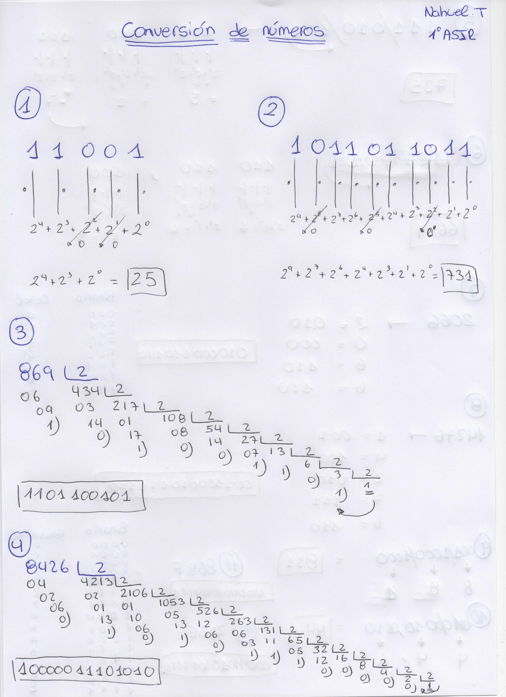
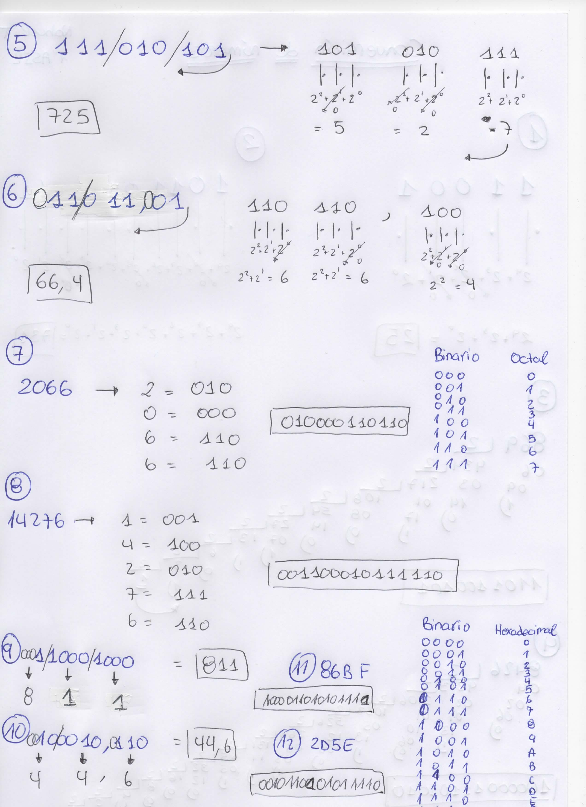

# ACTIVIDAD 2 PNI

Realizar las siguientes conversiones entre sistemas numéricos. Para cada una de las conversiones muestra el proceso que has seguido para hacerlas.
### 1. Para pasar de binario a decimal:
-  __a) 11001__: 25 
-  __b) 1011011011__: 731
### 2. Para pasar de decimal a binario:
-  __a) 869__: 1101100101
-  __b) 8426__: 10000011101010
### 3. Para pasar de binario a octal:
-  __a) 111010101__: 725
-  __b) 11011,01__: 66.4
### 4. Para pasar de octal a binario:
-  __a) 2066__: 010000110110
-  __b) 14276__: 001100010111110
### 5. Para pasar de binario a hexadecimal:
-  __a) 110001000__: 811
-  __b) 100010,110__: 44.6
### 6. Para pasar de hexadecimal a binario:
-  __a) 86BF__: 1000011010101111
-  __b) 2D5E__: 0010110101011110

